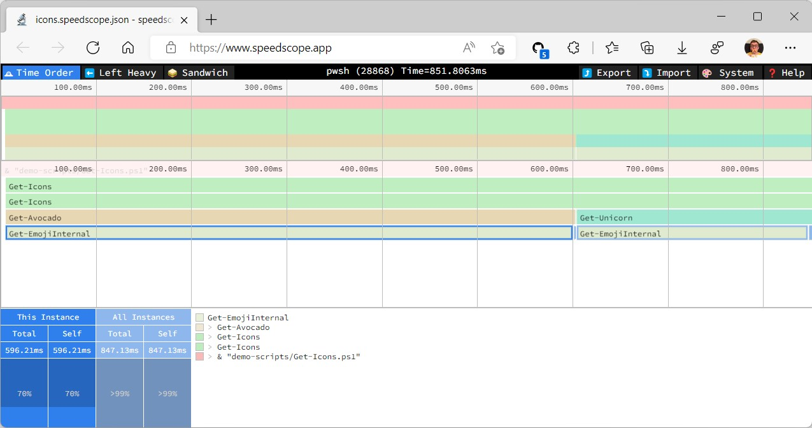

# Profiler

Script, ScriptBlock and module performance profiler for PowerShell 5, and PowerShell 7 that works in Windows, Linux and MacOS. 

## Demo

See my Profiler talks [on Youtube](https://youtube.com/playlist?list=PL_47l_1HjEMJfMMsYBLIY35T7eLOyJz3C), together with other people's talks about PowerShell performance.

## Quick start

Install the module [from PowerShell gallery](https://www.powershellgallery.com/packages/Profiler/): 

```powershell
Install-Module Profiler
```

```powershell
$trace =  Trace-Script -ScriptBlock { & "demo-scripts/Get-Icons.ps1" } -ExportPath icons
$trace.Top50SelfDuration
```


Inspect the output, SelfPercent, and SelfDuration represent time that is spent only in the function, excluding all the code it calls. 

Percent and Duration represent time that is takes by the function an all the code it calls.

In our screenshot 98.6% of the execution time is taken by `Invoke-WebRequest`, which runs inside of `Get-EmojiInternal` function inside of `Avocado` module.

You also specified export path which exports the results in https://speedscope.app format. Importing the file will show this result: 



Which shows us graphical representation of the run. We can see that two paths, `Get-Avocado` and `Get-Unicorn` both end up calling `Get-EmojiInternal` where most of the time in the script is spent.

## More Features 

- Profile module functions, or any scriptblock.
```powershell
$scriptBlock = { 
    Import-Module Pester
    Invoke-Pester
}
Trace-Script -ScriptBlock $scriptBlock
```

(Excluding files, e.g. Pester internals from the profiling is coming later.)


- Run code multiple times, comparing performance before and after your changes. 

```powershell
$flag = @{ _profiler = $true }
Invoke-Script -ScriptBlock $scriptBlock -Preheat 0 -Repeat 3 -Flag $flag
```


- Look at a file or portion of a file

```powershell
# to see the whole file 
$trace.Files[0].Profile | Format-Table

# or to get first 10 lines 
$trace.Files[0].Profile[0..9] | Format-Table
```


- Retrieve the last profile when you did not assign it to a variable 

```powershell 
Invoke-Script -ScriptBlock $scriptBlock -Preheat 0 -Repeat 3 -Flag $flag

# Output:
# Looks like you did not assign the output to a variable. Use Get-LatestTrace to retrieve the trace, e.g.: $trace = Get-LatestTrace

$trace = Get-LatestTrace
$trace.Top50Duration
```

- Progress of your changes

Running profiling multiple times in a row keeps the previous times to show you your progress. Indicating Before and After with B and A.


- And more, like breakdown of a given line (.CommandHits), seeing who called given line (.Hits) and seeing the call stack that lead to the current call. All of them just need to be documented first. 

## Know limitations:

This module is under heavy development. Here are some limitations of my current desing that I know how to fix, but that are not high on priority list:

- Using Set-PSDebug -Off, or Set-PSDebug -Trace 0 stops the tracing, because that is what we internally use to enable and disable it. If this is a must for you let me know in issues.

- Removing all breakpoints from the current session stops tracing. We add a synthetic breakpoint to prevent this, but if your code needs to remove all breakpoints, including the ones that are not "your own" let me know in issues.


